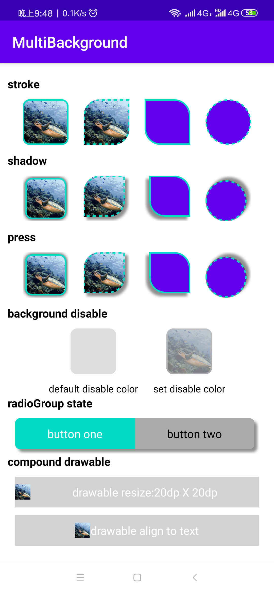
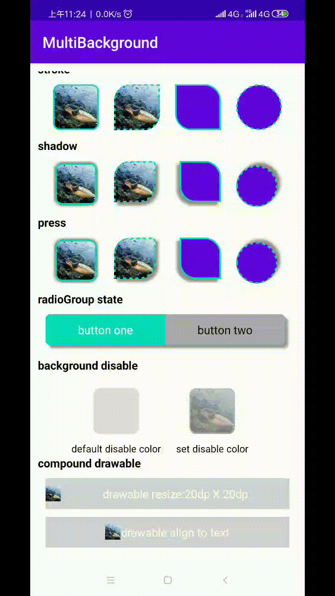
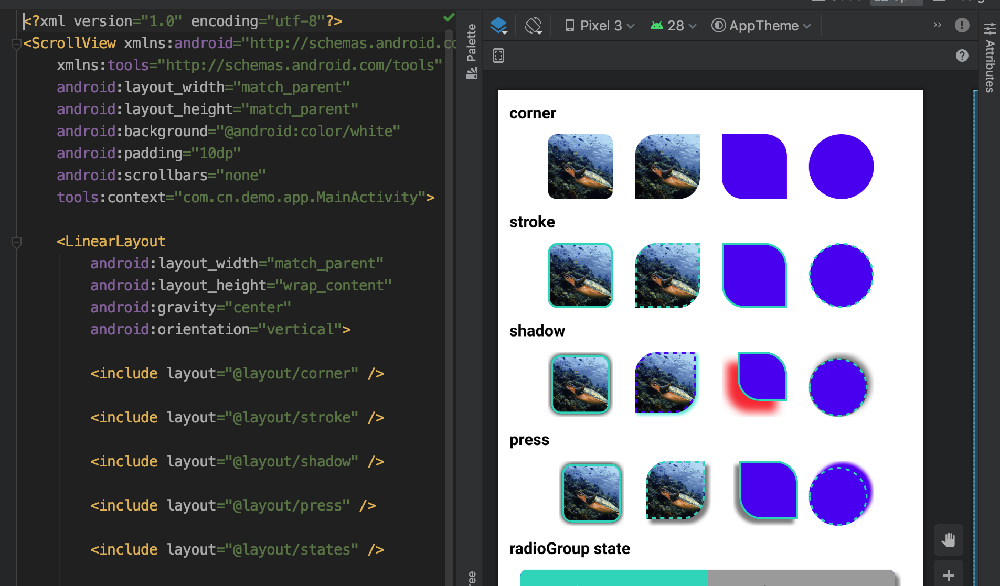

# android-multibackground
a background util that can easily create corner、stroke、shadow and the background state showing 
### SCREEN SHOT

<center>

<figure>


</figure>
</center>

preview real-time when editing layout file

<figure>

</figure>


## Usage

### Step 1
1. Add  repositories in your  **project build.gradle** file.
```groovy
buildscript {
    repositories {
        ...
        maven { url "https://jitpack.io" }
    }
}
allprojects {
    repositories {
       ...
       maven { url "https://jitpack.io" }
    }
}
```
2. Add dependency
```groovy
dependencies {
  ...
	implementation 'com.github.yangbo001:android-multibackground:1.0.0'
}
```
