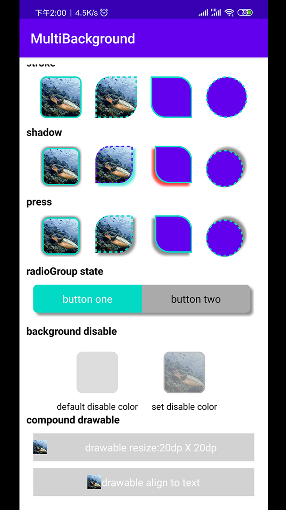

# android-multibackground
a background util that can easily create corner、stroke、shadow and the background state showing 
### SCREEN SHOT


<center>

<figure>

</figure>
</center>


## Usage

### Step 1

Add below dependency in your **build.gradle** file.

```groovy
dependencies {
	implementation 'com.github.yangbo001:android-multibackground:1.0.0'
}
```
